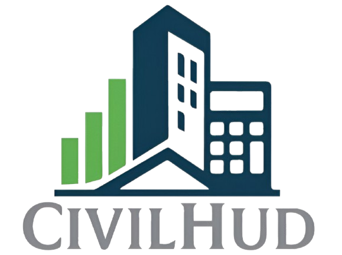

# CivilHud 🏗️

<p align="center">
  
</p>

**CivilHud** es una plataforma web innovadora que transforma la forma en que se calculan y adquieren materiales de construcción en Nicaragua.

> 📊 Desde el cálculo exacto de materiales hasta la comparación de precios entre ferreterías, CivilHud busca reducir desperdicios, ahorrar costos y digitalizar la experiencia de compra en el sector construcción.

---

## ✨ Características principales

- 📐 **Cálculo de materiales** según necesidades específicas de construcción.
- 💰 **Ahorro del 15-30%** gracias a estimaciones optimizadas.
- 📄 **Reportes detallados y descargables**.
- 🏪 **Comparación transparente de precios** entre ferreterías.
- 🤝 **Ferreterías con acceso a nuevos clientes** y licitaciones digitales justas.
- 🌐 **Integración única** de cálculos técnicos + subasta digital en una sola plataforma.

---

## 🚀 Tecnologías utilizadas

- [](https://angular.dev)
- [](https://supabase.com)
- [](https://www.typescriptlang.org/)

---

## ⚙️ Configuración de Entornos

Este proyecto utiliza **variables de entorno** para configurar servicios externos como Supabase.  
Debes asegurarte de configurar correctamente los archivos en `src/environments/`:

- `environment.ts` → Configuración para desarrollo.
- `environment.prod.ts` → Configuración para producción.
- `environment.example.ts` → Ejemplo incluido en el repositorio (usa este archivo como plantilla).

Ejemplo:

```ts
// src/environments/environment.ts
export const environment = {
  production: false,
  supabaseUrl: 'https://your-project.supabase.co',
  supabaseKey: 'public-anon-key',
};
```

## 🛠️ Desarrollo

### Servidor de desarrollo

```bash
ng serve
```

Navega a http://localhost:4200/ 🚀. La aplicación se recargará automáticamente al hacer cambios en los archivos fuente.

### Generar componentes con el CLI de Angular

```bash
ng generate component component-name
```

También puedes generar directivas, pipes, servicios y más:

```bash
ng generate --help
```

## 🛠️ Contruccion del proyecto

```bash
ng build
```

Esto compilará el proyecto y almacenará los artefactos en la carpeta dist/.
El build de producción incluye optimizaciones para rendimiento y velocidad.

## 🧪 Testing

**Unit Tests**

Ejecuta los tests unitarios con Karma:

```bash
ng test
```
**End-to-End Tests**

Ejecuta pruebas end-to-end (E2E):

```bash
ng e2e
```
⚠️ Angular CLI no incluye por defecto un framework E2E. Debes elegir uno (por ejemplo Cypresso Playwright).

## 📊 Modelo de Negocio (Canvas)

**Propuesta de valor**
CivilHud es la integración única de cálculos técnicos y subasta digital en una sola web.

✅ Ahorro económico y reducción de desperdicios para usuarios.

✅ Transparencia y acceso a nuevos clientes para ferreterías.

✅ Inclusión digital de usuarios con y sin conocimientos técnicos.

✅ Reducción de la economía informal en el sector construcción.

<p align="center">
    <h1 align="center">💡 Construyendo el futuro de la construcción digital en Nicaragua.</h1>
</p>